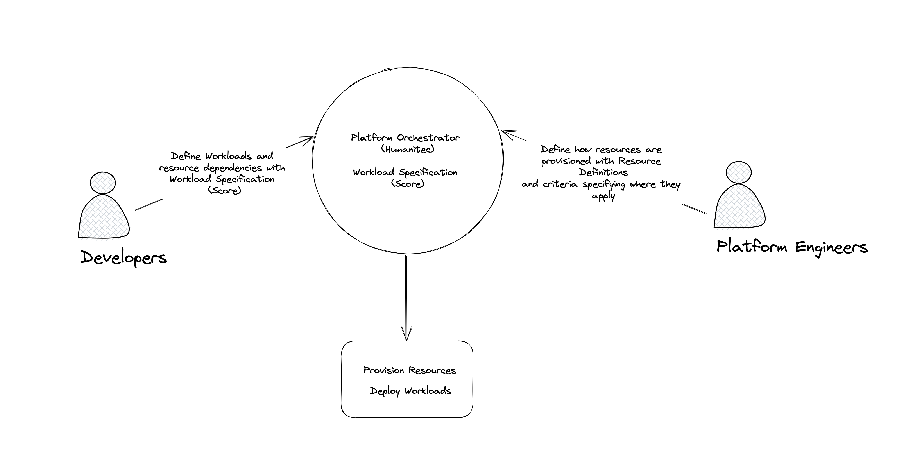

# Create Resource Definitions with Terraform in Humanitec

## Introduction

Resource Definitions are used to: 

- Configure how a resource is provisioned. By provisioning, we mean connecting or creating a new resource when a workload is deployed.
- Define matching criteria for the resource definition. This specifies the conditions and context when a resource definition is used. For example, you can provision a Postgres DB for a workload in AWS for a workload in the development environment but do GCP for production.



There are various types of resource definitions depending on the driver they use; here are a few notable examples:

- [Terraform](https://docs.humanitec.com/integrations/resource-drivers/terraform): Uses terraform module to create resources whenever this definition is used.
- [Static](https://docs.humanitec.com/integrations/resource-drivers/static): It generally does not create resources but connects to existing resources; more accurately, it uses the inputs given as outputs for the resource assigned to the workload.
- [Driver specific](https://docs.humanitec.com/integrations/resource-drivers): Humanitec comes bundled with drivers, such as S3, or MariaDB that can create resources of various types.

## Overview

Resource definitions can also be configured with the API and the UI, but Terraform is a favorite method by most users. This guide will cover how to create static resources in Terraform, we will be using Mariadb and S3 as examples.

It’s important to differentiate the two different ways Humanitec interacts with Terraform. This tutorial involves using the Terraform Provider for Humanitec to create Resource Definitions within Humanitec. A typical use case for this would be for Terraform-managed long-running resources like K8s clusters. You could include these Provider commands to automatically register the infrastructure created by Terraform in Humanitec at the end of the infrastructure generation process. At the end of the day, these resources’ lifecycle is outside the control of Humanitec.

The other way not covered by this tutorial involves using the Humanitec Terraform driver to get Humanitec to invoke Terraform to generate resources/dependencies. Here these resources lifecycles are controlled by Humanitec.

## **Prerequisites**

Before starting this tutorial, you’ll need:

- [A Humanitec account](https://app.humanitec.io/) (if you don’t have an account yet, explore the full functionality of Humanitec and test it free for 45 days)
- [score-humanitec](https://docs.score.dev/docs/get-started/install/) installed on your computer.
- A POSIX-Compliant Bash terminal (otherwise, you may need to change the commands below slightly)
- [curl](https://curl.se/)
- [jq](https://stedolan.github.io/jq/)
- Terraform (We are using v1.41 for this tutorial)

## Personas

This tutorial is ideal for:

- **Platform Engineers** looking to understand how Resource Definitions work
- **Developers** wanting to learn how the resources for their workloads are created.

## The Terraform Files

This is an overview of all the Terraform files we will be using in this tutorial. Don’t worry about copying and creating these files manually, we will be cloning a [repository](https://github.com/humanitec-tutorials/resource-definitions-terraform) later containing all of them as a step of the tutorial below.

### provider.tf

This file is used to configure the [Humanitec Provider](https://registry.terraform.io/providers/humanitec/humanitec/latest/docs):

```json
provider "humanitec" {
   org_id = var.humanitec_organization
}

terraform {
  required_providers {
    humanitec = {
      source = "humanitec/humanitec"
    }
  }
}
```

- For the provider we are not including token information for extra safety, we will be configuring that with an environment variable later

### main.tf

This file defines everything that will be deployed by terraform:

```json
### Application configuration ###
# Used to create an application

resource "humanitec_application" "app" {
  id   = var.app_name
  name = var.app_name
  depends_on = [
    humanitec_resource_definition.s3static,
     humanitec_resource_definition.db
  ]
}

### Resource definition configuration ###
# Used to create static resource definitions

resource "humanitec_resource_definition" "s3static" {
  driver_type = "humanitec/static"
  id          = "${var.app_name}-s3-static"
  name        = "${var.app_name}-s3-static"
  type        = "s3"

  driver_inputs = var.s3_static_driver_inputs

  criteria = [
    {
      app_id = var.app_name
    }
  ]

}

resource "humanitec_resource_definition" "db" {
  driver_type = "humanitec/static"
  id          = "${var.app_name}-mariadb-static"
  name        = "${var.app_name}-mariadb-static"
  type        = "mariadb"

  driver_inputs = var.db_static_driver_inputs
  
  criteria = [
    {
      app_id = var.app_name
    }
  ]

}
```

Our terraform code creates the following:

- Create a static Resource Definition for an S3 bucket
- Create a static Resource Definition for a MariaDB
- Create an Application for Workloads (We will use this later to deploy a Workload with Score)
- Both resources have app_id criteria. These criteria will cause workloads deployed in the app we create to use this resource definition to create these types of resources.

### variables.tf

All of the configuration is defined here (except for the Humanitec token which will be defined as an environment variable). 

```json
### REQUIRED ###

### Humanitec Configuration Variables ###
# Please note that Humanitec token config is not included here. You can set this by exporting variable HUMANITEC_TOKEN

variable "humanitec_organization" {
    description = "REQUIRED: used to specify the organization where the resources, token and application will be applied" 
}

### OPTIONAL ###

variable "app_name" {
    type = string
    default = "terraform-rd-tutorial-app"
    description = "OPTIONAL: Used to create an app and also to configure the names of the resource definitions created"
}

### Humanitec Resource Driver Inputs ###
# Object variables keep the resource configuration leaner.

variable "db_static_driver_inputs" {
  type = object({
    secrets = object({
        username = string
        password = string})
    values = object({
        name = string
        host = string
        port = number })
  })

  description = "OPTIONAL: Object used to provide driver inputs to the mariadb resource definition in this tutorial"

  
  default = {
    secrets = {
      username : "mrdeveloperusername",
      password : "unguessablepassword"

    },
    values = {
      name : "dbname",
      host : "hostdb",
      port : 3306
    }
  }

}

variable "s3_static_driver_inputs" {
  type = object({
    secrets = object({
        aws_access_key_id = string
        aws_secret_access_key = string})
    values = object({
        bucket = string
        region = string
         })
  })

  description = "OPTIONAL: Object used to provide driver inputs to the S3 resource definition in this tutorial"
 
  default = {
    secrets = {
      aws_access_key_id : "ULTRA-SECRET",
      aws_secret_access_key : "EVEN-MORE-SECRET"

    },
    values = {
      bucket : "bucket-of-joy",
      region : "eu-west-1"
    }
  }
  
}
```

- All configuration variables are optional except for the organization. This makes it easy to follow this tutorial without having to provide an inordinate amount of configuration parameters.
- You can change any of the inputs provided with your terraform.tfvars file, but ensure you do not commit it to a repository if it has secrets in it.

### terraform.tfvars.example

```json
## GLOBAL CONFIG

humanitec_organization = "happy-corp"

## APP CONFIG

app_name = "jaunty-app"

## RESOURCE DEFINITIONS CONFIG

db_static_driver_inputs = {
    secrets = {
      username : "mrdeveloper",
      password : "unguessablepassword"

    },
    values = {
      name : "jovialdb",
      host : "grinparadise",
      port : 3306
    }
  }

s3_static_driver_inputs = {
    secrets = {
      aws_access_key_id : "ULTRA-SECRET",
      aws_secret_access_key : "EVEN-MORE-SECRET"

    },
    values = {
      bucket : "bucket-of-joy",
      region : "eu-west-1"
    }
  }
```

- Rename this file to terraform.tfvars if you want to change the inputs. Not required to follow this tutorial.

## The Score File

The Score file is our Workload Specification. We will use it to deploy a workload that uses the resource definitions we created.

```yaml
apiVersion: score.dev/v1b1
metadata:
  name: backend
containers:
  backend:
    image: alpine
    command: ["/bin/sh"]
    args: ["-c", "sleep 5; while true; do echo : Mocking connection to DB with $${CONNECTION_STRING} and S3 bucket $${S3_BUCKET_NAME} on region $${S3_BUCKET_REGION}; sleep 10; done"]
    variables:
      CONNECTION_STRING: jdbc:mariadb://${resources.db.host}:${resources.db.port}/fi?user=${resources.db.username}&password=${resources.db.password}
      S3_BUCKET_NAME: ${resources.storage.bucket}
      S3_BUCKET_REGION: ${resources.storage.region} 
resources:
  db:
    type: mariadb
    properties:
      host:
      port:
      name:
      username:
      password:
  storage:
    type: s3
    properties:
      bucket:
      region:
```

- This file creates a Workload that outputs the values for the resources we provision with our resource definition. It does not connect the resources because, in our tutorial, they don’t exist; it mocks the connection string to show how all the configurations are fetched automatically via outputs.

## The Tutorial

You only need a token and an organization key to follow this tutorial, you can get them by signing up to our trial here. All other inputs are defaulted for simplicity but a `terraform.tfvars` file is provided for convenience if you want to use custom values.

### Step 1: **Clone the repository**

```bash
git clone https://github.com/humanitec-tutorials/resource-definitions-terraform.git ; cd resource-definitions-terraform
```

### **Step 2: Export Config Variables**

You can pass the Humanitec token as a terraform value or export as a variable for terraform to pick it up. For extra safety we are going to export the token and not add it as a variable in terraform like so:

```bash
export HUMANITEC_TOKEN="enter your Humanitec token here"
```

We will also be exporting application and organization variables to use in the command line with Score and Terraform:

```bash
export HUMANITEC_APP="terraform-rd-tutorial-app"
```

```bash
export HUMANITEC_ORG="enter your Humanitec org here"
```

To get the Humanitec Token, go into the UI and click on the API Tokens menu:


You can find the organization name at the bottom left corner of the screen:

 


And you can also find it in the URL:


### **Step 3: Apply terraform to create App and Resources**

```bash
terraform apply -var "humanitec_organization=$HUMANITEC_ORG" -auto-approve
```

### Step 4: Apply Score file delta to deploy your workload.

```bash
score-humanitec delta --env development --app $HUMANITEC_APP --org="${HUMANITEC_ORG}" --token "${HUMANITEC_TOKEN}" --deploy
```

### Step 5: Verify resources and deployment

Go to Humanitec UI —> Resource Management and you will see this:


S3 Resource definitions will look like this:


With the following matching criteria:


MariaDB resource definition:


With a Matching Criteria:


Now go to Applications —> terraform-rd-tutorial-app and you will find the running workload:


Observe the output and all the configuration:


### Step 6: Clean up

```bash
terraform destroy -var "humanitec_organization=$HUMANITEC_ORG" -auto-approve
```

## Conclusion

Resource Definitions are an essential part of deploying workloads in Humanitec. They provide a way to configure and provision resources for your applications based on various criteria. In this tutorial, we covered how to create Resource Definitions using Terraform, and we explored the different types of Resource Definitions and how to use them.

With the combination of Terraform and Humanitec, you can automate the entire process of provisioning and deploying your applications. This can save you time and effort, allowing you to focus on more critical tasks.

If you haven't already, sign up for a [free trial](https://app.humanitec.io/) of Humanitec to explore how to use Resource Definitions and Terraform to streamline your application deployment process.